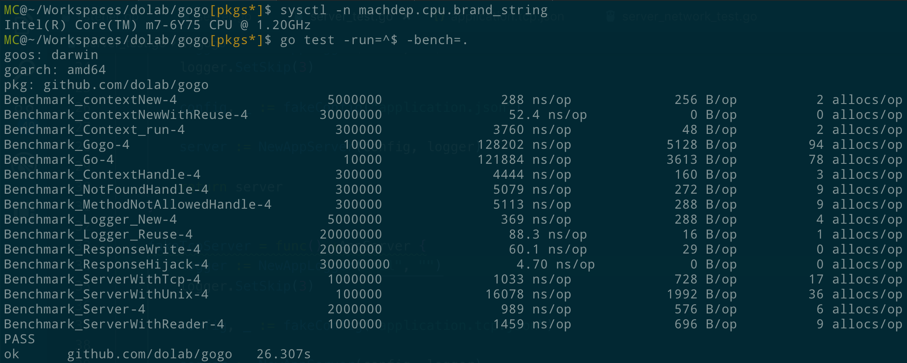

# gogo

[](https://circleci.com/gh/dolab/gogo/tree/master) [](http://gocover.io/github.com/dolab/gogo) [](http://godoc.org/github.com/dolab/gogo)

`gogo` is an open source, high performance RESTful api framework for the [Golang](https://golang.org) programming language. It also support RPC api, which is similar to [gRPC](https://grpc.io), defined by [protobuf](https://developers.google.com/protocol-buffers/).

It's heavily inspired from [rails](http://rubyonrails.org/) for best practice.

> NOTE: From *VERSION 2*, gogo requires `go1.10+` support. If you want to support `go1.6` or older, please use released tag [v1.0.0](https://github.com/dolab/gogo/releases/tag/v1.0.0) instead.

> NOTE: The *VERSION 3* introduces a big broken!!! And the API is frozen from now. We **Strongly** advice you to start from it for your product.

## Install

```bash
$ go get github.com/dolab/gogo/cmd/gogo
```

- Create application using scaffold tools

```bash
# show gogo helps
$ gogo -h

# create a new application
$ gogo new myapp

# resolve dependences
$ cd myapp
$ make

# generate controller
# NOTE: you should update application.go and add app.Resource("/user", User) route by hand
$ gogo g c user

# generate filter
$ gogo g f session

# generate model
$ gogo g m user

# run test
$ make

# run development server
$ make godev
```


## Getting Started

- Normal

```go
package main

import (
	"net/http"

	"github.com/dolab/gogo"
)

func main() {
	// load config from config/application.yml
	// app := gogo.New("development", "/path/to/[config/application.yml]")

	// load config from filename
	// app := gogo.New("development", "/path/to/config.yml")

	// use default config
	app := gogo.NewDefaults()

	// GET /
	app.GET("/", func(ctx *gogo.Context) {
		ctx.Text("Hello, gogo!")
	})

	// GET /hello/:name
	app.HandlerFunc(http.MethodGet, "/hello/:name", func(w http.ResponseWriter, r *http.Request) {
		params := gogo.NewParams(r)

		name := params.Get("name")
		if name == "" {
			name = "gogo"
		}

		w.WriteHeader(http.StatusOK)
		w.Write([]byte("Hello, " + name + "!"))
	})

	app.Run()
}
```

- Using filters

Middlewares is the best practice of doing common processing when handling a request.

```go
package main

import (
	"github.com/dolab/gogo"
)

func main() {
	app := gogo.NewDefaults()

	// avoid server quit by registering a recovery filter
	app.Use(func(ctx *gogo.Context) {
		if panicErr := recover(); panicErr != nil {
			ctx.Logger.Errorf("[PANICED] %v", panicErr)

			ctx.SetStatus(http.StatusInternalServerError)
			ctx.Json(map[string]interface{}{
				"panic": panicErr,
			})
			return
		}

		ctx.Next()
	})

	// GET /
	app.GET("/", func(ctx *gogo.Context) {
		panic("Oops ~ ~ ~")
	})

	app.Run()
}
```

- Using group

Group is useful when defining resources with shared filters and the same uri prefix.

```go
package main

import (
	"encoding/base64"
	"net/http"
	"strings"

	"github.com/dolab/gogo"
)

func main() {
	app := gogo.NewDefaults()

	// avoid server quit by registering recovery func global
	app.Use(func(ctx *gogo.Context) {
		if panicErr := recover(); panicErr != nil {
			ctx.Logger.Errorf("[PANICED] %v", panicErr)

			ctx.SetStatus(http.StatusInternalServerError)
			ctx.Json(map[string]interface{}{
				"panic": panicErr,
			})
			return
		}

		ctx.Next()
	})

	// NewGroup creates sub resources with /v1 prefix, and apply basic auth filter for all sub-resources.
	// NOTE: it combines recovery filter from previous.
	v1 := app.NewGroup("/v1", func(ctx *gogo.Context) {
		auth := ctx.Header("Authorization")
		if !strings.HasPrefix(auth, "Basic ") {
			ctx.SetStatus(http.StatusForbidden)
			return
		}

		b, err := base64.StdEncoding.DecodeString(strings.TrimPrefix(auth, "Basic "))
		if err != nil {
			ctx.Logger.Errorf("Base64 decode error: %v", err)

			ctx.SetStatus(http.StatusForbidden)
			return
		}

		tmp := strings.SplitN(string(b), ":", 2)
		if len(tmp) != 2 || tmp[0] != "gogo" || tmp[1] != "ogog" {
			ctx.SetStatus(http.StatusForbidden)
			return
		}

		// settings which can used by following filters and handler
		ctx.Set("username", tmp[0])

		ctx.Next()
	})

	// GET /v1/user
	v1.GET("/user", func(ctx *gogo.Context) {
		username := ctx.MustGet("username").(string)

		ctx.Text("Hello, " + username + "!")
	})

	app.Run()
}
```

- Use Resource Controller

You can implement a *controller* with optional `Index`, `Create`, `Explore`, `Show`, `Update` and `Destroy` methods, 
and use `app.Resource("/myresource", &MyController)` to register all RESTful routes auto.

NOTE: When your resource has a inheritance relationship, there **MUST NOT** be two same id key.
you can overwrite default id key by implementing `ControllerID` interface.

```go
package main

import (
	"github.com/dolab/gogo"
)

type GroupController struct{}

// GET /group
func (t *GroupController) Index(ctx *gogo.Context) {
	ctx.Text("GET /group")
}

// GET /group/:group
func (t *GroupController) Show(ctx *gogo.Context) {
	ctx.Text("GET /group/" + ctx.Params.Get("group"))
}

type UserController struct{}

// overwrite default :user key with :id
func (t *UserController) ID() string {
	return "id"
}

// GET /group/:group/user/:id
func (t *UserController) Show(ctx *gogo.Context) {
	ctx.Text("GET /group/" + ctx.Params.Get("group") + "/user/" + ctx.Params.Get("id"))
}

func main() {
	app := gogo.NewDefaults()

	// register group controller with default :group key
	group := app.Resource("/group", &GroupController{})

	// nested user controller within group resource
	// NOTE: it overwrites default :user key by implmenting gogo.ControllerID interface.
	group.Resource("/user", &UserController{})

	app.Run()
}
```

## Configures

- Server

```yaml
---
mode: test
name: gogo

default_server: &default_server
  addr: localhost
  port: 9090
  ssl: false
  request_timeout: 3
  response_timeout: 10
  request_id: X-Request-Id

default_logger: &default_logger
  output: nil
  level: debug
  filter_params:
    - password
    - password_confirmation

sections:
  test:
    server:
      <<: *default_server
      request_id: ''
    logger:
      <<: *default_logger
    domain: https://example.com
    getting_start:
      greeting: Hello, gogo!
    debug: false
```

## Benchmarks



## TODOs

- [x] server config context
- [x] support http.Request context
- [x] scoffold && generator
- [x] mountable third-part app
- [x] gRPC support

## Thanks

- [httprouter](https://github.com/julienschmidt/httprouter)

## Author

[Spring MC](https://twitter.com/mcspring)

## LICENSE

```
The MIT License (MIT)

Copyright (c) 2016

Permission is hereby granted, free of charge, to any person obtaining a copy
of this software and associated documentation files (the "Software"), to deal
in the Software without restriction, including without limitation the rights
to use, copy, modify, merge, publish, distribute, sublicense, and/or sell
copies of the Software, and to permit persons to whom the Software is
furnished to do so, subject to the following conditions:

The above copyright notice and this permission notice shall be included in all
copies or substantial portions of the Software.

THE SOFTWARE IS PROVIDED "AS IS", WITHOUT WARRANTY OF ANY KIND, EXPRESS OR
IMPLIED, INCLUDING BUT NOT LIMITED TO THE WARRANTIES OF MERCHANTABILITY,
FITNESS FOR A PARTICULAR PURPOSE AND NONINFRINGEMENT. IN NO EVENT SHALL THE
AUTHORS OR COPYRIGHT HOLDERS BE LIABLE FOR ANY CLAIM, DAMAGES OR OTHER
LIABILITY, WHETHER IN AN ACTION OF CONTRACT, TORT OR OTHERWISE, ARISING FROM,
OUT OF OR IN CONNECTION WITH THE SOFTWARE OR THE USE OR OTHER DEALINGS IN THE
SOFTWARE.
```
